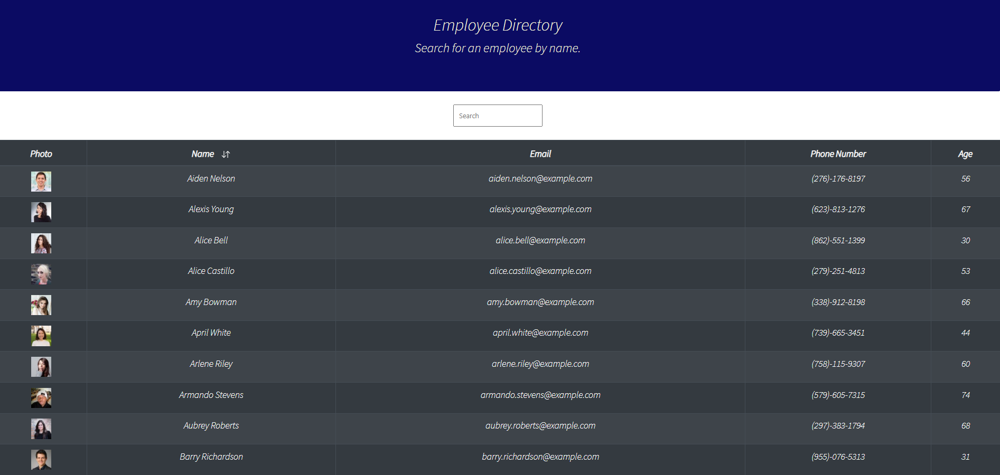

# Employee Directory
## Table of Contents 
* [Project Description](#description)
* [Installation](#installation)
* [Usage](#usage)
* [Contributors](#contributors)
* [Tests](#tests)
* [License](#license)
* [Questions](#questions)

## Project Description
Need a way to view an entire employee directory at once so that the user can have quick access to their information? Employee Directory is the application for you! This application allows an employee or manager to view non-sensitive data about other employees. Data about the employee's are as follows: photo of employee, name, email, phone number, and age. The user can filter in the search box by name. Additionally, the user will also be able to click the up/down arrow to filter by name in ascending/descending order. You are now ready to keep track of employee information in an organized manner!  

Below is an example that shows the application's appearance and functionality:

## Home Page

## Deployed Link
Please feel free to visit the live web application. Link is below.

[Employee Directory]()

## Installation
Before running the application, the user must execute the command "npm install" to install all of the required dependencies. You're all set once all dependencies are installed!

## Usage
In order to run this application locally, run the command "npm run start" in the terminal. This will execute the application where the user will be able to view all employees and filter them by name, along with sorting them by ascending/descending order. You can also visit the deployed link above.

## Contributors
Please feel free to create pull requests. They will be reviewed before merging. If you would like to make any major changes, please open an issue to discuss these changes.

## Tests
No tests were created for this application.

## License
This project is licensed through MIT License 

## Questions
If you have any questions, please feel free to contact the owner of this repository. Their contact info is listed below:

### 
GitHub Username: dannyphan6 

GitHub Repository: https://github.com/dannyphan6 

Email Address: dannyphan@comcast.net